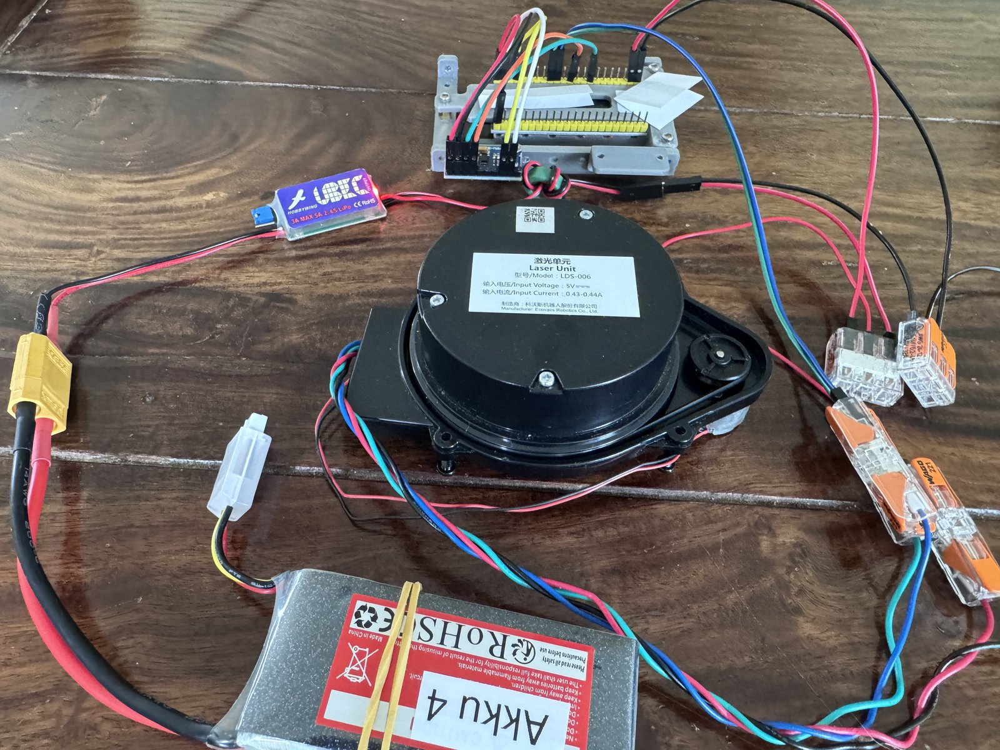

# lds006_ros2

ROS 2 driver and protocol library for the **LDS-006** — the 360° laser distance
sensor found in Ecovacs Deebot robot vacuums, sold as a spare part for about
€20–25.

Publishes `sensor_msgs/LaserScan`. Tested on ROS 2 Jazzy / Ubuntu 24.04 on a
Raspberry Pi 4.

> Deutschsprachige Fassung dieser Anleitung: [README.de.md](README.de.md)



*Identification: the model number and power rating are printed on the top face —
`LDS-006`, `5V`, `0.43-0.44A`, Ecovacs Robotics. Shown here on the bench with an
ESP32-S3 used for the protocol work.*

## Why this exists

The LDS-006 uses XV-11 (Neato) **framing**, so every XV-11 driver synchronises
onto the stream correctly — and then rejects every single frame. Two things
differ:

- **The checksum is a plain 16-bit sum of bytes 0..19**, not the XV-11 shift-add.
  Measured: 371/371 frames match the byte sum, 0/371 match XV-11.
- **The speed field divides by 100, not 64.** Cross-checked against the data
  rate: 9900 B/s ÷ 22 ÷ 90 = 5.0 rev/s = 300 rpm.

There is a third trap that costs more than both. During spin-up and spin-down the
sensor emits **status frames** with an index outside the angle range (`0xFB`),
whose four sample slots hold the constant pattern `77 77 00 00`. Bit 7 of the
second byte is **clear**, so a naive parser reads it as a *valid* measurement of
14199 mm — a ring of phantom walls at 14 m on every start.

Full measured specification: **[PROTOCOL.md](PROTOCOL.md)**.

## Wiring

| Wire | Function | Level |
|---|---|---|
| black | GND | — |
| red | Vcc | **5 V** |
| blue | sensor TX | 3.3 V |
| green | sensor RX | 3.3 V |

115200 8N1, no level shifter needed for a 3.3 V host. Connect via a USB-serial
adapter unless you have a spare hardware UART.

**Power: 5 V at 0.43–0.44 A** per the unit's own label — about 2.2 W. That is
more than a marginal USB port will happily give alongside a host board; feed it
from a dedicated 5 V supply rather than a dev board's 5 V pin if you can.

**The sensor sends nothing until it receives `startlds$`** (no line terminator).
A silent sensor is not necessarily a wiring fault.

## Try it without ROS

```bash
python3 tools/lds006_dump.py --port /dev/ttyUSB0
```

Prints rotation speed, packet count, valid points and a coarse all-round view per
revolution. A healthy run reads **~300 rpm, 90/90 packets, 0 checksum errors**.

Works without hardware too, against the recorded captures in this repo:

```bash
python3 tools/lds006_dump.py --datei test/data/lauf_dauerbetrieb.bin
```

## Build and run

```bash
cd ~/ros2_ws && colcon build --packages-select ant_lidar
source install/setup.bash && ros2 launch ant_lidar lds006.launch.py
```

| Parameter | Default | Meaning |
|---|---|---|
| `port` | `/dev/ttyUSB0` | serial port |
| `frame_id` | `laser` | TF frame in the header |
| `mirror` | `true` | flip rotation direction (see below) |
| `offset_deg` | `0` | shift the zero direction |
| `only_complete` | `true` | publish only gap-free revolutions |

## Two things drivers get wrong

**Rotation direction.** Viewed from above the sensor scans counter-clockwise, so
the protocol's index direction opposes a top-down view. Without mirroring you get
a *plausible* mirror image — distances and room shape look right, only the
direction is wrong. While driving it shows up only as a map that fails to close,
and suspicion falls on odometry first. The node then converts from the vehicle
convention (clockwise) to REP 103 (counter-clockwise).

**Dropouts.** A missing reading must **not** be reported as `0.0` — zero is a
valid reading close to the sensor. REP 117 defines three values, and the sensor's
two error codes map onto them exactly:

| Code | Meaning | `LaserScan` |
|---|---|---|
| `0x88` | closer than measurable | `-inf` |
| `0x99` | no return | `+inf` |
| anything else | unclear | `nan` |

## Layout

```
ant_lidar/lds006.py        pure protocol — no dependencies, no I/O
ant_lidar/serial_link.py   transport; pyserial is used only here
ant_lidar/lidar_node.py    ROS 2 node -> sensor_msgs/LaserScan
tools/lds006_dump.py       CLI, no ROS required
test/                      17 tests against recorded sensor data
```

`lds006.py` runs without a sensor and without ROS, which is why the tests check
the protocol against real captures in `test/data/` rather than against
assumptions — including a counter-test that the XV-11 checksum accepts 0 of 371
frames.

```bash
python3 -m pytest test/ -q
```

## Firmware variants exist

Findings here were measured on one unit. Published sources disagree with it in
two places: a documented `!` `<pwm>` `!` motor-control frame has **no effect**
here, and a `5A A5` startup frame described elsewhere **never appears**.
Measurements from other units are welcome — please open an issue.

## Credits

Protocol work builds on and corroborates
[opravdin/lds-006-reverse-engineering](https://github.com/opravdin/lds-006-reverse-engineering),
[jentsch.io](https://www.jentsch.io/lds-006-lidar-sensor-reverse-engineering/) and
[0x416c6578](https://0x416c6578.github.io/posts/005-LDS-006-Hacking.html).

MIT licensed.
